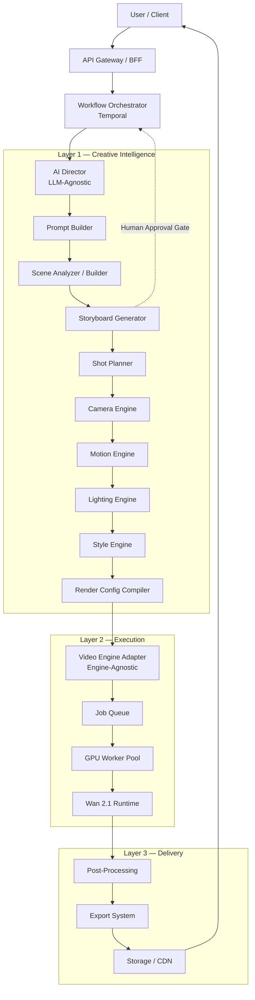

# نظام Claude Director + Video Engine مفتوح المصدر
## System Design / Architecture Document — v0.1 (Draft for Approval)

> **الحالة:** تصميم هندسي فقط — لا يوجد كود تنفيذي بعد. بعد الموافقة ننتقل لتنفيذ كل Module على حدة (Phase by Phase) كما هو موضّح في القسم الأخير.

---

## 1. الرؤية والمبدأ الأساسي

الهدف ليس بناء منافس لـ Claude، بل بناء **منافس لـ Runway / Pika / Luma / Veo / Sora**، باستخدام:

- **طبقة تخطيط إبداعي (Creative Intelligence Layer)** — أي LLM يلعب دور "المخرج" فقط.
- **طبقة تنفيذ فيديو (Video Execution Layer)** — تبدأ بـ Wan 2.1 (Open Source) وتتطور لاحقاً إلى نموذج تأسيسي خاص.

الفصل بين الطبقتين ليس اختيارياً — هو **جوهر التصميم**. كل قرار معماري أدناه مبني على مبدأ واحد:

> **لا يوجد أي مكوّن في النظام يعرف اسم "Claude" أو اسم "Wan2.1" بشكل صريح — الكل يتكلم عبر Interfaces/Contracts محايدة.**

### المبادئ الهندسية الملزمة (Non-negotiable Design Principles)

| # | المبدأ | لماذا |
|---|--------|-------|
| 1 | **LLM-Agnostic Director Layer** | استبدال Claude بأي LLM آخر (GPT, Gemini, نموذج محلي) بدون لمس أي Module آخر |
| 2 | **Engine-Agnostic Video Layer** | استبدال Wan2.1 بمحرك خاص لاحقاً بدون إعادة كتابة النظام |
| 3 | **Structured Contracts, not Free Text** | كل تواصل بين الطبقات هو JSON مُتحقق منه بـ Schema، وليس نص حر ملصق ببعضه |
| 4 | **Deterministic Middle Layer** | الـ Planners (Camera/Motion/Lighting/Style) منطق عمل حتمي وقابل للاختبار، ليست "prompt hacks" |
| 5 | **Versioned Everything** | Schemas, Prompts, Templates, Capability Manifests — كل شيء له نسخة ومسار ترقية |
| 6 | **Human-in-the-loop Checkpoint** | مراجعة الـ Storyboard قبل الـ Render الكامل (توفير تكلفة GPU ضخمة) |
| 7 | **Capability-Driven Compilation** | المُخرج (Compiler) يستعلم عن قدرات المحرك الحالي قبل توليد الأوامر النهائية |

---

## 2. المخطط العام (High-Level Architecture)



### تدفق الحوكمة (Governance Flow) بشكل مبسّط

```
User Request
   ↓
AI Director (LLM Layer)             ← ILLMProvider (Claude اليوم، أي LLM لاحقاً)
   ↓  DirectorPlan (JSON, versioned)
Creative Compiler Pipeline          ← منطق حتمي، لا LLM إجباري هنا
   (Scene → Storyboard → Shot → Camera → Motion → Lighting → Style)
   ↓  [Approval Gate بواسطة المستخدم]
Render Configuration Compiler       ← يستعلم Capability Manifest للمحرك الحالي
   ↓  RenderSpec (JSON, engine-agnostic)
Video Engine Adapter                ← IVideoEngine (Wan2.1 اليوم، Engine خاص لاحقاً)
   ↓
GPU Worker Pool → Wan 2.1 Runtime
   ↓  Raw Clips
Post-Processing (stitch/upscale/grade/audio)
   ↓
Export System → CDN → Final MP4
```

---

## 3. طبقات النظام (System Layers) بالتفصيل

### Layer 0 — Client
- Web App (المستخدم)، وربما لاحقاً Mobile/API عملاء خارجيين (B2B).

### Layer 1 — API Gateway / BFF
- نقطة دخول واحدة: Auth، Rate limiting، Request validation، Billing metering.
- يستدعي الـ **Workflow Orchestrator** ولا يعرف أي تفاصيل داخلية عن LLM أو محرك الفيديو.

### Layer 2 — Workflow Orchestrator
- محرك تنسيق حالة طويلة الأمد (durable workflow) يدير كامل الـ Pipeline، يشمل نقاط التوقف البشرية (موافقة الـ Storyboard)، إعادة المحاولة عند فشل GPU، والـ timeouts.

### Layer 3 — AI Director (Creative Intelligence Layer)
هذه هي الطبقة التي تحل محل "عقل" الشركة. **مقسّمة داخلياً لمنع أي اعتماد مباشر على مزوّد LLM معيّن.**

### Layer 4 — Creative Compiler Pipeline
سلسلة الـ Planners (Scene → Storyboard → Shot → Camera → Motion → Lighting → Style → Render Config). هذه الطبقة **لا تتحدث مع أي LLM أو أي Video Engine مباشرة** — فقط تستهلك DirectorPlan وتُخرج RenderSpec.

### Layer 5 — Video Engine Adapter
نقطة الاستبدال الحرجة. تحوّل RenderSpec المحايد إلى استدعاء خاص بمحرك معيّن (Wan2.1 اليوم).

### Layer 6 — Execution (Queue + GPU Workers)
تنفيذ فعلي على GPU، مع إدارة تحميل النماذج (Model Loader/Cache) لتفادي إعادة تحميل الأوزان الضخمة لكل مهمة.

### Layer 7 — Post-Processing & Export
دمج اللقطات، الترقية (upscaling)، الـ interpolation، الصوت، الترجمة، الـ watermark، التصدير بصيغ متعددة.

### Layer 8 — Data Plane
PostgreSQL + Redis + Object Storage + Vector DB — تُشرح في قسم التقنيات.

### Cross-Cutting Concerns (تخترق كل الطبقات)
Auth & Billing, Observability, Config Service, Plugin Registry, Model Registry.

---

## 4. تقسيم المشروع إلى Modules (تفصيلي)

### 4.1 AI Director (`services/ai-director`)
**المسؤولية:** تحويل طلب المستخدم الخام إلى `DirectorPlan` منظم — القصة، المشاهد، النبرة، القيود الزمنية.
**لا يفعل:** لا يولّد فيديو، لا يكتب أوامر خاصة بمحرك معيّن.

- يعمل خلف واجهة `ILLMProvider` فقط:
  ```
  ILLMProvider {
    generate(SystemPrompt, UserContext, OutputSchema) -> StructuredResult
    supportsTools() / supportsVision() / contextWindow()
  }
  ```
- Adapters: `ClaudeProvider`, `OpenAIProvider`, `GeminiProvider`, `LocalLLMProvider` (مستقبلاً) — **جميعها تُسجَّل في Plugin Registry**، والتبديل بينها هو تغيير سطر Config واحد فقط.
- المخرجات مُلزَمة بـ JSON Schema صارم (`DirectorPlan.v1.schema.json`) عبر Structured Output / Tool-calling — لا يُسمح بنص حر غير مُتحقق منه.
- **DirectorPlan** يتضمن: `logline`, `target_duration`, `aspect_ratio`, `global_style`, `mood_refs`, `scenes[]`, `negative_prompt_global`, `continuity_notes`.

### 4.2 Prompt Builder / Prompt Engineering Engine (`services/prompt-builder`)
- يحوّل نوايا `DirectorPlan` إلى نصوص Prompt متخصصة، **لكل محرك لهجته الخاصة** (Wan2.1 يفضّل صياغة معينة، محرك مستقبلي قد يفضّل غيرها).
- يستهلك `Prompt Library` + `Template Library`.
- يُخرج `PositivePrompt` + `NegativePrompt` لكل Shot، مع Style Tokens.

### 4.3 Scene Analyzer / Scene Builder (`services/scene-builder`)
- يقسّم `logline` إلى Scenes، يحسب ميزانية الوقت لكل مشهد، يتتبع الاستمرارية (continuity) بين المشاهد (نفس الشخصية/المكان/الإضاءة).

### 4.4 Storyboard Generator (`services/storyboard-generator`)
- يولّد لوحة قصة نصية + صور مرجعية اختيارية (عبر نموذج توليد صور منفصل) لكل Shot — **نقطة المراجعة البشرية الأهم** قبل استهلاك أي GPU للفيديو الكامل.

### 4.5 Shot Planner (`services/shot-planner`)
- يحدد قائمة اللقطات: نوع اللقطة (Wide/Medium/Close/Insert)، المدة، الترتيب، الانتقال الداخل/الخارج (Cut/Dissolve/Match Cut).

### 4.6 Camera Engine (`services/camera-engine`)
- العدسة (مكافئ البعد البؤري)، زاوية الكاميرا، الحركة (Pan/Tilt/Dolly/Crane/Handheld/Static)، عمق الميدان.

### 4.7 Motion Engine (`services/motion-engine`)
- شدة حركة الموضوع، سرعة الحركة، الـ speed ramps، Motion Strength (بارامتر يفهمه Wan2.1 تحديداً — يُترجم هنا).

### 4.8 Lighting Engine (`services/lighting-engine`)
- إعداد الإضاءة (Key/Fill/Rim)، وقت اليوم، الحالة المزاجية، مراجع HDRI/بيئة.

### 4.9 Style Engine (`services/style-engine`)
- الـ Color Grading (LUT refs)، الأسلوب البصري (سينمائي/أنمي/واقعي)، رموز الاتساق (Seed / Style Embedding) عبر كل اللقطات لضمان تناسق الفيديو الكامل.

### 4.10 Render Configuration Compiler (`services/render-config-compiler`)
**أهم نقطة تجريد في كامل النظام.** يدمج مخرجات كل الـ Planners في `RenderSpec` واحد موحّد لكل Shot:

```
RenderSpec.v1 {
  shot_id, duration, fps, resolution, aspect_ratio,
  positive_prompt, negative_prompt,
  camera: {...}, motion: {...}, lighting: {...}, style: {...},
  conditioning_images: [...],   // لـ Image-to-Video
  seed, engine_hint (اختياري)
}
```

- يستعلم `Capability Manifest` للمحرك النشط حالياً (مثلاً: أقصى مدة للقطة، الدقة المدعومة، هل يدعم I2V) **ويُكيّف** الخطة تلقائياً (مثال: لو المحرك يدعم لقطة أطول، يقلّل عدد التقسيمات).
- هذا هو ما يجعل استبدال Wan2.1 لاحقاً **بدون تعديل** أي Planner أعلاه.

### 4.11 Video Engine Adapter (`packages/video-engine-sdk` + `services/video-engine-adapter`)
```
IVideoEngine {
  capabilities() -> CapabilityManifest
  submit(RenderSpec) -> EngineJobHandle
  pollStatus(EngineJobHandle) -> {status, progress}
  fetchResult(EngineJobHandle) -> RawClip
}
```
- **Wan21Adapter**: تنفيذ حالي (T2V, I2V, Video Editing عبر Wan2.1).
- **مستقبلاً**: `MyFoundationModelAdapter` — نفس الواجهة، صفر تغييرات في الطبقات الأعلى.
- هذا الـ Module هو **حرفياً** نقطة "اليوم Wan2.1 ← بعد سنة My Video Foundation Model" التي طلبتها.

### 4.12 Render Orchestrator / GPU Worker Manager (`services/render-orchestrator`, `workers/gpu-worker`)
- استهلاك الطابور، جدولة GPU، إدارة تحميل النماذج (Model Loader) والاحتفاظ بها "دافئة" في VRAM، إعادة المحاولة، معالجة الدُفعات (Batching).

### 4.13 Post-Processing (`services/post-processing`)
- دمج اللقطات + الانتقالات، Frame Interpolation (RIFE)، الترقية (Real-ESRGAN)، تطبيق الـ Color Grading، الصوت/الموسيقى/TTS، الترجمة، العلامة المائية.

### 4.14 Export System (`services/export-service`)
- تصدير متعدد الصيغ (MP4/H.264, ProRes)، قصّ للنسب المختلفة (عمودي/أفقي لمنصات التواصل)، توليد Thumbnails، رفع لـ CDN، Webhooks.

### 4.15 API (`apps/api-gateway`)
- REST/GraphQL علني (submit job, get status, gallery)، وgRPC/Message Bus داخلي بين الخدمات.

### 4.16 Frontend (`apps/web`)
- إدخال الطلب، مراجعة/تعديل الـ Storyboard (نقطة الموافقة)، محرر Timeline خفيف، معرض الأعمال، الفوترة.

### 4.17 Backend (مظلة للخدمات أعلاه)
- إدارة المشاريع/الـ Workspaces، Auth، Billing، الحوكمة العامة.

### 4.18 Training (`services/training`) — مسار مستقبلي موازٍ
- خط أنابيب بيانات، Fine-tuning/LoRA، إطار تقييم (Eval Harness) لتطوير نموذج الفيديو التأسيسي الخاص لاحقاً.

### 4.19 Plugins (`plugins/*`)
- سجل Plugins لثلاث فئات: LLM Providers، Video Engines، Post-FX Filters — تسجيل عبر Manifest بدون تعديل الكود الأساسي.

### 4.20 Config (`packages/config-sdk`, `configs/`)
- إعدادات لكل بيئة، Feature flags لكل عميل/Tenant، **Capability Manifests** لكل محرك فيديو (كملفات YAML قابلة للتعديل بدون نشر كود جديد).

### 4.21 Models (`models/`)
- سجل النماذج (Model Registry): مسارات الأوزان، الإصدار، بيانات الترخيص (تتبّع Apache-2.0 الخاص بـ Wan2.1)، Capability Manifest لكل نموذج.

### 4.22 Assets (`services/asset-manager`)
- صور/فيديوهات مرجعية من المستخدم، أصول وسيطة (إطارات Storyboard)، سياسة دورة حياة وتنظيف.

### 4.23 Prompt Library (`libraries/prompt-library`)
- مقاطع Prompt قابلة لإعادة الاستخدام ومُصنّفة حسب الأسلوب، مُصدَّرة بإصدار، مرتبطة بحلقة تغذية راجعة للجودة.

### 4.24 Template Library (`libraries/template-library`)
- قوالب `DirectorPlan` كاملة لأنواع فيديو شائعة (إعلان منتج، تريلر، فيديو تعليمي) لرفع جودة/اتساق مخرجات AI Director من اليوم الأول.

---

## 5. هيكل المجلدات المقترح (Monorepo)

```
video-ai-platform/
├── apps/
│   ├── web/                     # Next.js — واجهة المستخدم
│   ├── api-gateway/             # BFF / API العلني
│   └── admin/                   # لوحة تحكم داخلية (Ops)
│
├── services/
│   ├── ai-director/
│   ├── prompt-builder/
│   ├── scene-builder/
│   ├── storyboard-generator/
│   ├── shot-planner/
│   ├── camera-engine/
│   ├── motion-engine/
│   ├── lighting-engine/
│   ├── style-engine/
│   ├── render-config-compiler/
│   ├── video-engine-adapter/
│   ├── render-orchestrator/
│   ├── post-processing/
│   ├── export-service/
│   ├── asset-manager/
│   └── training/                 # مسار مستقبلي
│
├── workers/
│   └── gpu-worker/               # حاوية تشغيل Wan2.1 على GPU
│
├── packages/                     # مكتبات مشتركة
│   ├── schemas/                  # DirectorPlan, RenderSpec, ... (JSON Schema)
│   ├── llm-providers/            # ILLMProvider + Adapters
│   ├── video-engine-sdk/         # IVideoEngine + Capability types
│   ├── config-sdk/
│   └── observability/
│
├── libraries/
│   ├── prompt-library/           # بيانات، وليست كود
│   └── template-library/
│
├── plugins/
│   ├── llm-providers/
│   ├── video-engines/
│   └── post-fx/
│
├── infra/
│   ├── docker/
│   ├── k8s/ (Helm charts)
│   ├── terraform/
│   └── ci-cd/
│
├── models/
│   ├── wan2.1/                   # manifest + إشارة لموقع الأوزان (ليست الأوزان نفسها في git)
│   └── registry.yaml
│
├── configs/
│   ├── environments/
│   └── capability-manifests/
│
└── docs/
    ├── architecture/
    └── adr/                      # Architecture Decision Records
```

---

## 6. اختيار التقنيات (Technology Stack)

| المكوّن | التقنية المقترحة | السبب |
|---|---|---|
| **Frontend** | Next.js + TypeScript + Tailwind + WebSocket | تجربة تفاعلية لمراجعة Storyboard وتتبع تقدّم الـ Render لحظياً |
| **API Gateway** | FastAPI (Python) | توحيد اللغة مع كل خدمات الـ ML/Backend، تكامل أسهل مع مكتبات AI |
| **Backend Services** | Python (FastAPI) لكل الخدمات | Wan2.1 و PyTorch أصلاً Python — تقليل الاحتكاك بين Creative Layer وExecution Layer |
| **Workflow Orchestration** | **Temporal.io** | مثالي لخط أنابيب طويل مع نقاط موافقة بشرية، إعادة محاولة، ومهام GPU طويلة الأمد |
| **Job Queue (GPU dispatch)** | Redis Streams أو RabbitMQ + Celery | فصل توزيع المهام عن منطق الـ Workflow |
| **GPU Scheduling** | Kubernetes + NVIDIA device plugin + KEDA (autoscale على عمق الطابور) | تحجيم تلقائي حسب الطلب، دعم Spot GPUs لتقليل التكلفة |
| **Model Serving/Loading** | Triton Inference Server أو Worker دائم مخصص | إبقاء أوزان Wan2.1 "دافئة" في VRAM لتفادي كلفة إعادة التحميل لكل مهمة |
| **Database** | PostgreSQL | المشاريع، المستخدمون، الفوترة، الـ Jobs |
| **Cache** | Redis | حالة المهام، الجلسات، Cache للـ Prompts المُركَّبة |
| **Object Storage** | S3 / Cloudflare R2 | الفيديوهات، الصور المرجعية، الأصول الوسيطة |
| **Vector DB** | Qdrant / pgvector | بحث تشابه في Prompt Library، اتساق الأسلوب عبر Embeddings |
| **Message Bus (أحداث)** | NATS أو Kafka | أحداث دورة حياة المهمة، Webhooks، تكامل بين الخدمات |
| **Auth** | Auth0 / Keycloak (OAuth2 + JWT) | إدارة هوية موحدة |
| **Billing** | Stripe + Metering مخصص لثواني-GPU | تسعير قائم على الاستهلاك الفعلي |
| **CI/CD** | GitHub Actions + ArgoCD | نشر مستمر لكل الخدمات المستقلة |
| **IaC** | Terraform + Helm | بنية تحتية قابلة للتكرار عبر البيئات |
| **Observability** | OpenTelemetry + Prometheus/Grafana + Sentry | تتبّع أداء كل مرحلة من الـ Pipeline (خصوصاً زمن الـ GPU) |
| **Schema Validation** | Pydantic (Python) / Zod (لو وُجد جزء TS) | فرض العقود بين الطبقات بصرامة |
| **LLM Access Layer** | غلاف رفيع مخصص فوق كل مزوّد (وليس ربط مباشر بـ SDK واحد) | استقلالية عن أي مزوّد، بما فيه Claude |

---

## 7. آلية استبدال محرك الفيديو (Engine Swap Strategy) — التفصيل المطلوب

هذا هو الجزء الذي يضمن الانتقال من:
```
اليوم:     Claude → ... → Wan 2.1
بعد سنة:   Claude → ... → My Video Foundation Model
```
**بدون إعادة كتابة أي شيء فوق طبقة الـ Adapter.**

### كيف يعمل عملياً

1. **Capability Manifest** لكل محرك (ملف Config وليس كود):
   ```yaml
   engine: wan2.1
   max_shot_duration_sec: 5
   supported_resolutions: [480p, 720p]
   fps_options: [16, 24]
   modes: [text_to_video, image_to_video, video_edit]
   motion_strength_range: [0, 100]
   ```
   عند إضافة محرك جديد، تُضاف فقط Manifest + Adapter جديد.

2. **Render Configuration Compiler** لا "يعرف" اسم المحرك — يقرأ الـ Manifest النشط ويُكيّف RenderSpec تلقائياً (مثال: لو المحرك الجديد يدعم لقطات أطول، تقل الحاجة لتقسيم مشهد لعدة لقطات).

3. **Video Engine Adapter** هو الوحيد الذي "يعرف" تفاصيل التنفيذ الخاصة بـ Wan2.1 (كيفية استدعاء الـ Pipeline، صياغة الـ prompt الخاصة به، أبعاد الإدخال). عند بناء المحرك الخاص، يُكتب `MyEngineAdapter` جديد يطبّق نفس `IVideoEngine` — وينتهي الأمر.

4. **إستراتيجية انتقال تدريجي (وليس قفزة واحدة):**
   - **مرحلة أ:** Wan2.1 لكل الأنواع.
   - **مرحلة ب:** محرك خاص يُستخدم لنوع محتوى معيّن فقط (مثلاً I2V) عبر **Routing Rule** في الـ Compiler، بينما يبقى Wan2.1 للباقي.
   - **مرحلة ج:** استبدال كامل بعد ثبات الجودة، مع الاحتفاظ بـ Wan2.1 كـ Fallback قابل للتفعيل بسطر Config واحد.

### نفس المبدأ يُطبَّق على طبقة LLM
`ILLMProvider` تسمح بتشغيل A/B بين Claude ومزوّد آخر لنفس `DirectorPlan.v1` Schema دون أي تغيير في الـ Prompt Builder أو ما بعده.

---

## 8. الـ Caching والأداء

| المستوى | ما يُخزَّن مؤقتاً | الفائدة |
|---|---|---|
| LLM Layer | نتائج DirectorPlan لطلبات متشابهة (بصمة Prompt) | تقليل تكلفة/زمن استدعاء LLM |
| Prompt Builder | Prompt Templates المُركَّبة | تفادي إعادة بناء نفس الصياغة |
| Model Loader | أوزان Wan2.1 محمّلة دائماً في GPU Workers "الدافئة" | تفادي زمن تحميل ضخم (قد يكون ثواني إلى دقائق) لكل مهمة |
| Storyboard | صور معاينة منخفضة الدقة/الخطوات | تسريع مرحلة موافقة المستخدم قبل الـ Render الكامل |
| CDN | الفيديوهات النهائية + Thumbnails | تسليم سريع للمستخدم النهائي |

**Tiered Rendering (رافعة تكلفة مهمة):** بما أن RenderSpec منفصل عن التنفيذ، يمكن تنفيذ نفس الـ Spec بجودة منخفضة/خطوات أقل لمعاينة الـ Storyboard، ثم بجودة كاملة فقط بعد موافقة المستخدم — توفير GPU ضخم لأن معظم التكرار الإبداعي يحدث *قبل* الـ Render المكلف.

---

## 9. إدارة الإصدارات (Versioning Strategy)

- **Schemas** (`DirectorPlan`, `RenderSpec`, `CapabilityManifest`): Semantic Versioning + طبقة Migration بين الإصدارات (`v1 → v2`) بدون كسر الخدمات القديمة.
- **Prompt Library / Template Library**: كل عنصر له `version`, `created_by`, `quality_score` (من تغذية راجعة لاحقة)، مخزّنة كبيانات (git أو DB) وليست مدفونة في الكود.
- **Model Registry**: كل نموذج فيديو مرتبط بإصدار Adapter متوافق معه؛ لا يُسمح بترقية نموذج دون تحديث/اختبار الـ Adapter المرتبط.
- **API**: إصدار صريح في المسار (`/v1/...`) لضمان استقرار العملاء الخارجيين لاحقاً.

---

## 10. النشر والتوسّع (Deployment & Scalability)

- **Docker** لكل خدمة (صورة منفصلة لكل Module — استقلالية النشر).
- **Kubernetes**: Node pools منفصلة — CPU pool للخدمات العادية، GPU pool مخصص لـ `gpu-worker`.
- **Autoscaling**: KEDA يُحجّم GPU Workers حسب عمق طابور الـ Render Queue، وليس حسب CPU (المقياس غير المناسب لأعباء GPU).
- **Spot/Preemptible GPUs** لتخفيض التكلفة، مع Checkpointing للمهام الطويلة حتى لا تُفقد عند استرجاع الجهاز.
- **Region واحد كبداية** (عنق الزجاجة هو توفر GPU لا الجغرافيا)، مع CDN عالمي لتسليم الفيديو النهائي فقط.
- **Multi-tenancy**: عزل منطقي (Workspace/Tenant ID) في كل جدول ومهمة منذ اليوم الأول، حتى لو النظام يخدم عميلاً واحداً حالياً.

---

## 11. الأمن وحماية الملكية الفكرية

- ترخيص Wan2.1 (Apache-2.0 تقريباً حسب المشروع) يُتتبَّع صراحة في `models/registry.yaml` — أي محرك يُضاف لاحقاً يمر بنفس فحص الترخيص.
- أوزان النماذج **لا** تُخزَّن في Git — فقط في Model Registry/Object Storage مع تتبّع Hash/إصدار.
- Prompt Library وTemplate Library (أصل تنافسي حقيقي مع الوقت) معزولة في مساحة بيانات خاصة قابلة للتشفير/الوصول المحكوم، منفصلة عن كود المصدر المفتوح المحتمل.
- فحص أمني قياسي على API Gateway: rate limiting, input validation صارم قبل الوصول لأي LLM (لمنع Prompt Injection يوصل لطبقات التنفيذ).

---

## 12. خارطة الطريق للتنفيذ (Implementation Roadmap)

> بعد موافقتك، ننفّذ Phase بعد Phase — كل Phase يُسلَّم ويُختبَر قبل الانتقال للتالي.

| Phase | المحتوى |
|---|---|
| **0 — الأساسات** | Schemas (`DirectorPlan`, `RenderSpec`, `CapabilityManifest`)، هيكل الـ Monorepo، هيكل Config/Plugin الأساسي |
| **1 — AI Director MVP** | تكامل Claude خلف `ILLMProvider`، توليد `DirectorPlan`، Prompt/Template Library v1 |
| **2 — Creative Compiler** | Scene/Shot/Camera/Motion/Lighting/Style Planners + Render Config Compiler + التحقق من Schema |
| **3 — Video Engine Adapter + Wan2.1** | `IVideoEngine`، `Wan21Adapter`، GPU Worker واحد، مسار T2V كامل من البداية للنهاية |
| **4 — Orchestration** | Temporal Workflows، طابور المهام، تجمّع GPU Workers، نقطة موافقة Storyboard البشرية |
| **5 — Post-Processing & Export** | دمج اللقطات، الترقية، التصحيح اللوني، الصوت، تصدير متعدد الصيغ |
| **6 — Frontend MVP** | تدفق: طلب → معاينة → موافقة → Render → تنزيل |
| **7 — التوسع** | Autoscaling متعدد GPU، Caching الكامل، تحسين التكلفة، الفوترة |
| **8 — مسار موازٍ طويل المدى** | خط بيانات + بنية تدريب لنموذج الفيديو التأسيسي الخاص، تبديل تدريجي عبر نفس الـ Adapter |

---

## 13. ملخص نقاط القرار التي تحتاج موافقتك

قبل بدء Phase 0، أحتاج تأكيدك على:

1. **لغة التنفيذ الموحّدة**: هل توافق على Python (FastAPI) لكل الـ Backend/Services لتقليل الاحتكاك مع Wan2.1/PyTorch؟ أم تفضّل TypeScript لبعض الخدمات غير الـ ML؟
2. **Workflow Engine**: Temporal.io يتطلب بنية تشغيلية إضافية (Temporal Server) — موافق عليها أم تفضّل بديل أبسط (مثل Celery فقط) في البداية؟
3. **بيئة GPU**: هل لديك بالفعل GPU/Cloud provider مُختار (RunPod, Lambda, AWS, بنية تحتية خاصة)؟ هذا يؤثر على تفاصيل Phase 3-4.
4. **نطاق الريبو**: هل يُبنى هذا كمشروع منفصل تماماً (Monorepo جديد)، أم يُدمَج لاحقاً بشكل ما مع تطبيق "صلّحلي" الحالي؟ (لاحظت أن هذا الريبو الحالي تطبيق Flutter لخدمات منزلية، غير مرتبط بمشروع الفيديو — أفترض أنه مجرد مكان مؤقت لهذا المستند).

